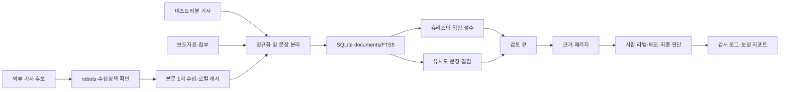
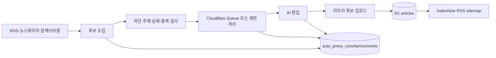

# CulturePeople 근거 기반 자체 기사화 자동화 로드맵

- 작성일: 2026-07-29 KST
- 분석 원본: `/mnt/win_d/Users/Documents/비즈니스트리뷴_기사검증프로그램`
- 적용 대상: CulturePeople
- 문서 성격: 설계, 구현 및 운영 상태 문서
- 구현 기준일: 2026-07-29 KST

## 구현 상태

| 단계 | 코드 | 테스트 | 운영 | 현재 판단 |
|---|---|---|---|---|
| P0 카탈로그·권리 게이트 | 완료 | 완료 | 로컬 read-only | 256건 중 fixture 156건, 권리 미확정 100건, 근거 사용 가능 0건 |
| P1 adapter·claim-evidence | MVP 완료 | fixture 회귀 완료 | report-only | 권리 확인 실제 pilot 50건과 편집자 2인 라벨이 없어 정확도 완료 기준은 blocked |
| P2 D1·API·편집실 | 완료 | 완료 | D1 migration 적용, feature off | 운영 후보 0건, 기존 기사·auto-press 영향 없음 |
| P3 근거 잠금 초안 | 완료 | 완료 | draft off | 승인된 evidence가 없어 운영 실행 blocked |
| P4 분석·정정·철회 | 코드 완료 | 완료 | 정정 공개 고지·RSS 연동은 승인된 기록만 노출 | 게시 기사와 연결된 실제 후보가 없어 운영 rehearsal blocked |
| P5 준비도 판정 | 완료 | 완료 | draft-only 고정 | 90일 shadow, pilot, holdout, 대표자 결정 전 자동 게시 blocked |

운영 D1에는 additive migration `0006_editorial_pipeline.sql`이 적용됐다. 13개 편집 전용 테이블이 있고 runtime은 `feature=false`, `shadow=false`, `draft=false`, `autoPublish=false`다. 외부 권리 확인이 끝나기 전에도 UI와 API 배포는 가능하지만, source 권리는 클라이언트 입력을 신뢰하지 않고 D1에서 superadmin이 확정한 값만 사용한다.

연동 문서:

- 편집·권리·자동화 정책: `docs/culturepeople-editorial-policy.md`
- 운영·장애·rollback 절차: `docs/culturepeople-editorial-operations-runbook.md`

## 0. 경영진 요약

Article Guard는 기사 생성기가 아니라 다음 기능을 가진 로컬 검증·검토 지원 시스템이다.

- 기사, 보도자료, 외부 기사 본문을 SQLite와 FTS5에 저장한다.
- 제목·본문 유사도, 문장 겹침, 포함도, 강한 표현 신호를 계산한다.
- 위험 후보를 검토 큐로 분류하고 근거 패키지를 만든다.
- 검토자의 라벨, 메모, 최종 판단과 변경 이력을 보존한다.
- 결과를 위반·표절 확정이 아닌 `위험 후보`와 `검토 필요`로 표현한다.

CulturePeople에는 이미 auto-press 수집·AI 편집·D1 큐·재시도·중복 방지·차단 정책·관찰 로그가 있다. 그러나 이 구조는 보도자료 자동등록 파이프라인이며, 그 결과를 곧바로 독립 취재 기사로 간주할 수는 없다.

목표는 auto-press를 억지로 자체 기사 생성기로 바꾸는 것이 아니다. 별도의 **편집 기사 후보 파이프라인**을 만들어 보도자료와 보유 데이터를 근거 후보로 수집하고, 독립 출처·자체 분석·사람의 편집 판단이 확보된 경우에만 자체 기사 등급을 부여하는 것이다.

가장 먼저 개발할 대상은 AI 초안 작성이 아니라 다음 세 가지다.

1. 데이터 카탈로그와 사용 권리 판정
2. 주장과 근거를 연결하는 evidence package
3. 자동 발행이 없는 shadow 검토 흐름

## 1. 목적과 제외 범위

### 1.1 목적

- 기사마다 어떤 자료에 근거했는지 재현할 수 있게 한다.
- 보도자료 전달과 자체 기사화를 명확히 구분한다.
- 중복·유사·광고성·민감 주제 위험을 발행 전에 찾는다.
- 반복적인 기계 작업은 자동화하고 편집 책임은 사람에게 남긴다.
- 보유 데이터를 출처·권리·완전성이 확인된 범위에서 기사 근거로 활용한다.

### 1.2 제외 범위

- 타사 기사나 보도자료를 단어만 바꿔 자체 기사처럼 보이게 만드는 기능
- 네이버뉴스·다음뉴스 제휴, 자동 송고, 심사 대응 기능
- auto-news 재활성화
- 민감 기사 무인 자동 발행
- 출처가 불명확한 원문을 모델 학습 데이터로 투입하는 작업
- 권리 확인 전 외부 기사 본문을 장기 보관하거나 재배포하는 작업
- 이번 문서 작성 단계의 코드·DB·배포 변경

## 2. 현행 시스템 구조

### 2.1 Article Guard 데이터 흐름



### 2.2 CulturePeople auto-press 데이터 흐름



### 2.3 목표 통합 구조

auto-press 게시 흐름은 유지하되, 자체 기사 후보는 별도 상태와 저장소를 사용한다.

```mermaid
flowchart LR
    AP[auto-press 자료] --> IN[Editorial intake]
    OD[권리 확인된 보유 데이터] --> IN
    ES[승인된 외부 근거] --> IN
    IN --> CAT[Data catalog·provenance]
    CAT --> CL[중복·군집·출처 독립성]
    CL --> CE[Claim-evidence graph]
    CE --> GT[품질·위험 gate]
    GT --> DR[AI 개요·초안 보조]
    DR --> RV[/cam/editorial-lab 사람 검토]
    RV -->|승인| PB[기존 기사 게시 API]
    RV -->|보류·반려| BK[보강·폐기]
    PB --> AU[정정·철회·감사 이력]
```

### 2.4 관리자 개입 지점

| 단계 | 현재 Article Guard | 현재 CulturePeople | 목표 |
|---|---|---|---|
| 수집 승인 | provider/config 승인 | auto-press source 설정 | 데이터원별 권리·용도 승인 |
| 위험 검토 | 로컬 UI 큐·라벨 | source quality·blocked policy | 통합 evidence review |
| 초안 | 없음 | AI 편집 | 근거 범위 내 개요·초안 보조 |
| 발행 승인 | 최종 승인/보류 기록 | auto-press 설정에 따라 게시 | 자체 기사는 명시적 사람 승인 |
| 사후 조치 | review history·audit | 기사 수정·삭제 | 정정·철회와 근거 버전 고정 |

## 3. 확인된 자산과 재사용 판정

### 3.1 Article Guard 데이터 현황

2026-07-29 SQLite 직접 조회로 재확인한 결과, 초안에 있던 표는 부정확했다. `biztribune_article`/`press_release`/`external_news`는 별도 테이블이 아니라 단일 `documents` 테이블의 `document_type` 컬럼 값이며, 256건 전체를 "실제 데이터"로 표기한 것도 틀렸다. 정정한 현황은 다음과 같다.

| 영역 | 확인 상태 | 의미 |
|---|---:|---|
| `data/article_guard.db` → `documents` | 256건 | 단일 테이블. 하위 구분은 `document_type` 컬럼 값 |
| `document_type = biztribune_article` | 100건 · **실데이터 형태의 수집본** | URL host가 모두 `www.biztribune.co.kr`이고 본문·기자명·article_id·발행일이 채워져 있다. 발행 범위는 2026-04-29~05-04 중 5개 날짜, 기자명은 14종이다. 이번 검토에서 URL의 현재 라이브 응답과 CulturePeople의 이용 권리는 확인하지 않았다 |
| `document_type = press_release` | 109건 · **전량 fixture** | 100건은 `source_name='harness_press_sample'`("하네스 보도자료 샘플 001" 등 합성 텍스트), 나머지 9건도 `exports/harness/fixtures/press_import/*`발 "테스트 기업" 샘플. 실제 보도자료 0건 |
| `document_type = external_news` | 47건 · **전량 fixture** | `source_name`이 `harness_media_1~3`, `harness_cache`, `*-harness.example.com`, `nokey-*.example.com` 등이며 본문은 biztribune 기사 제목을 그대로 재사용한 가짜 "관련기사". 실제 외부 기사 0건 |
| `risk_assessments` | 100건 | `document_id` JOIN 결과 전부 `biztribune_article`에 연결된 `mvp_baseline` 휴리스틱 결과. 실제 보도자료·외부 기사와 대조한 정확도 검증으로 볼 수 없음 |
| `review_queues` | 100건 | 위와 동일한 대상의 자동 큐 분류. 실제 편집자 판정이 아님 |
| `review_cases` / `review_history` | 10건 / 14건 · **전량 harness** | reviewer가 모두 `harness`, `harness-final`, `harness-final-ui`이며 calibration·UI smoke용 합성 판정이다. 실제 사람 검토 이력 0건 |
| 유사도·외부 캐시 관련 행 | fixture 기반 | `similarity_matches` 1건, `similarity_candidate_links` 12건, `cached_news_articles` 12건 등은 위 harness 외부 코퍼스에 연결된 기능 검증 자료 |
| `data/article_guard.sqlite` | 빈 골격 | 테이블은 있으나 주요 행은 0건 |
| `samples/`, `exports/`, `reports/` | 다수 존재 | `exports/harness/fixtures/`가 위 press_release·external_news의 원본 경로임을 확인. 나머지 폴더도 샘플·fixture·운영 증적 구분이 필요 |

**정정 사유**: 현재 DB에서 실제 기사 수집본으로 확인되는 후보는 `biztribune_article` 100건뿐이며, 이 또한 권리 확인 전에는 CulturePeople 기사 근거로 사용할 수 없다. `press_release`·`external_news` 156건(전체 256건의 61%)은 Article Guard 자체 QA를 위해 만든 합성 fixture이고 실제 사람 라벨도 없다. "DB 파일명이나 행 수만으로 실데이터 여부를 판단하면 안 된다"는 원칙은 이 DB 자체에도 적용해야 한다. 향후 catalog 명령은 테이블이 아니라 `document_type` × `source_name` 조합 단위로 행 수, 최신 시각, 출처 분포, fixture 여부를 함께 출력해야 한다.

### 3.2 검증 성숙도 판정

현재 Article Guard에서 재사용 가능한 것은 **구조와 기능 후보**이며, 기존 점수의 실전 정확도가 아니다.

- 100건의 대상 기사는 실제 기사 형태지만 비교 대상 보도자료·외부 기사는 전량 합성 자료다.
- 검토·보정 라벨도 모두 harness가 생성했으므로 실제 편집자의 판단 분포를 반영하지 않는다.
- 따라서 기존 위험 점수, 45/65점 임계값, 유사도 임계값, precision·recall을 CulturePeople 품질 gate에 그대로 사용할 수 없다.
- 기존 fixture는 parsing, schema, queue, UI, 오류 처리 같은 기능 테스트에는 계속 사용할 수 있다.
- 운영 임계값을 정하려면 사용 권리가 확인된 실제 보도자료·독립 기사·CulturePeople 기사로 소규모 pilot corpus를 만들고 최소 2인의 편집자 라벨로 보정해야 한다.
- pilot corpus가 없더라도 P0 catalog와 P1 report-only 엔진 개발은 가능하지만, 자동 승인·자동 발행 판단에는 사용할 수 없다.

### 3.3 재사용 매트릭스

| 자산 | 판정 | 활용 방법 | 주의 |
|---|---|---|---|
| SQLite 문서·FTS5 구조 | 개조 후 재사용 | 오프라인 후보 검색·검증 저장소 | D1 운영 모델과 직접 결합 금지 |
| URL·본문 1회 캐시 원칙 | 재사용 | 호출·부하 최소화 | robots와 이용약관 준수 |
| 유사도·문장 겹침·포함도 | 재사용 | 중복 및 원문 의존 위험 신호 | 표절 확정 판정 금지 |
| 강신호 규칙 | 개조 필요 | 숫자·인용·첫/끝 문단 비교 | 한국어 문장 분리 정확도 검증 |
| 검토 큐·라벨·이력 구조 | 재사용 | 향후 실제 편집자 보정과 감사 | 현재 저장된 라벨은 전량 harness이므로 보정 데이터로 사용 금지 |
| evidence package 개념 | 핵심 재사용 | 주장별 근거 묶음으로 확장 | 원문 snapshot 권리 정책 필요 |
| 위험 점수 임계값 | 실운영 판정 사용 금지 | 권리 확인된 pilot과 실제 편집자 라벨로 신규 보정 | 현재 값은 합성 비교 코퍼스 기반 |
| self-reporting 단어 감산 | 사용 금지 후 재설계 | 실제 증적 필드로 대체 | “본지 확인” 문구만으로 자체취재 인정 금지 |
| 네이버 벌점 시뮬레이션 | 범위 제외 | 일반 편집 위험 참고만 가능 | 현재 CulturePeople 목표와 불일치 |
| 외부 기사 본문·샘플 | 확인 결과 현재 보유분은 전량 harness fixture (3.1 참고) | 구조·파이프라인 검증용으로만 허용 | 실제 외부 기사가 아니므로 기사 생성 근거로 사용 금지. 근거로 쓰려면 실데이터를 별도로 수집하고 권리를 확인해야 함 |
| CulturePeople D1 observability | 재사용 | 후보·실행·이벤트 추적 | 편집 상태 테이블은 별도 필요 |
| CulturePeople 중복 검사 | 개조 필요 | URL·정규화 제목 1차 필터 | 의미상 유사 기사 군집 추가 필요 |
| auto-press 차단 정책 | 재사용 | intake 이전 안전 필터 | 공익·비판 문맥은 별도 검토 |
| auto-press AI 편집 | 직접 재사용 금지 | 프롬프트·출력 실패 사례만 참고 | 자체 기사 품질을 보장하지 않음 |

## 4. 데이터 카탈로그와 사용 가능성

### 4.1 필수 catalog 필드

| 필드군 | 필드 후보 |
|---|---|
| 식별 | `datasetId`, `recordId`, `sourceType`, `sourceName` |
| 출처 | `sourceUrl`, `publisher`, `collectedAt`, `publishedAt`, `snapshotHash` |
| 권리 | `usageBasis`, `license`, `allowedUses`, `expiresAt`, `rightsReviewer` |
| 품질 | `completeness`, `freshness`, `extractionQuality`, `duplicateGroupId` |
| 민감성 | `containsPii`, `containsMinor`, `sensitiveDomains`, `retentionClass` |
| 계보 | `parentRecordIds`, `collectorVersion`, `transformVersion`, `fixture` |
| 기사 사용 | `evidenceEligible`, `quotationEligible`, `trainingEligible`, `blockReason` |

### 4.2 데이터 등급

| 등급 | 정의 | 기사화 사용 |
|---|---|---|
| A | 공식 원문·공공데이터·직접 취재, 권리와 시점 확인 | 핵심 근거 가능 |
| B | 신뢰 가능한 독립 보도·보고서, 귀속 명확 | 보조·교차 검증 가능 |
| C | 기업 보도자료·이해관계자 주장 | 주장 출처로만 사용 |
| D | 검색 요약·출처 불명 캐시·권리 불명 | 후보 발견만 가능 |
| X | 개인정보·권리 위반·조작 의심·금지 source | 작성·학습·발행 금지 |

### 4.3 독립 출처 판정

- 동일 보도자료 문장을 공유하는 기사들은 여러 매체여도 하나의 `origin cluster`로 계산한다.
- canonical URL, 본문 fingerprint, 인용·수치 순서, 최초 발행 시각을 함께 사용한다.
- 기업 계열 뉴스룸과 동일 기업 보도자료는 독립 출처로 계산하지 않는다.
- 같은 보고서를 인용한 여러 기사도 사실 확인 출처는 원 보고서 하나로 센다.
- 독립성 판단이 불명확하면 출처 수를 늘리지 않고 `needs_source_review`로 보낸다.

### 4.4 기존 데이터 사용 전 게이트

1. 데이터 소유자와 수집 근거 확인
2. fixture·실데이터 구분
3. 본문 보관 및 파생물 생성 허용 범위 확인
4. 개인정보·민감정보 검사
5. 원문 삭제 요청과 보관 만료 처리 가능 여부 확인
6. 기사별 provenance 재현 가능 여부 확인

한 항목이라도 확인되지 않으면 해당 데이터는 후보 탐색과 구조 테스트 외 기사 작성에 사용하지 않는다. 예를 들어 article_guard.db의 press_release·external_news 156건은 3.1에서 이미 fixture로 확인되었으므로, 이 게이트의 2번 항목에서 자동으로 차단되고 별도 대표자 판단 없이도 기사 작성에 사용할 수 없다.

Article Guard의 기존 fixture는 기능 회귀 테스트에는 사용할 수 있지만 정확도·임계값 보정에는 사용할 수 없다. 보정용 pilot corpus는 다음 조건을 별도로 만족해야 한다.

- 실제 보도자료 또는 1차 자료, 파생 기사, 독립 보도를 origin 단위로 연결
- 각 자료의 수집·보관·분석·AI 입력 허용 범위 확인
- 민감정보를 제거하거나 별도 접근 통제
- 최소 2인의 편집자가 독립 라벨링하고 불일치 사유 기록
- 학습·보정용 corpus와 최종 평가용 holdout corpus 분리

## 5. CulturePeople 자체 기사 등급

| 등급 | 기사 유형 | 최소 근거 | 자체 기여 | 자동화 | 발행 조건 |
|---|---|---|---|---|---|
| CP-0 | 보도자료 전달 | 공식 원문 1개 | 정리·형식화 | auto-press 가능 | `보도자료` 성격과 출처 명시 |
| CP-1 | 큐레이션·종합 | 독립 origin 2개 이상 | 비교·맥락·차이 정리 | 초안 보조 | 근거 연결률 통과 + 사람 승인 |
| CP-2 | 데이터 분석 | 검증된 데이터셋 1개 이상과 방법론 | 계산·시각화·한계 설명 | 분석 보조 | 재현 가능한 산출물 + 사람 승인 |
| CP-3 | 해설 | 2개 이상 독립 근거와 1차 자료 | 편집 관점·배경·쟁점 | 개요 보조 | 사실/의견 구분 + 책임 편집 |
| CP-4 | 인터뷰·현장 취재 | 녹취·메모·동의·현장 증적 | 직접 질문·관찰 | 전사·정리 보조 | 기자 확인 + 인용 검수 |
| CP-5 | 후속·업데이트 | 기존 기사와 신규 1차 근거 | 변경점·영향 추적 | 변경 탐지 보조 | 변경 이력·정정 관계 표시 |

### 5.1 자체 기사 공통 최소 기준

- 제목이나 문장만 바꾼 보도자료는 CP-0을 넘을 수 없다.
- 핵심 주장마다 최소 하나의 사용 가능한 근거가 있어야 한다.
- CP-1 이상은 보도자료 복제 매체를 제외한 독립 origin이 필요하다.
- “분석”, “확인”, “취재” 표현은 실제 분석 산출물·검토 기록·취재 증적이 있을 때만 사용한다.
- AI가 만든 해석은 근거가 아니며, 근거가 확인된 내용을 정리하는 도구로만 취급한다.

## 6. 편집 원칙과 고위험 기준

### 6.1 사실·주장·의견 구분

| 유형 | 저장·표현 원칙 |
|---|---|
| 확인 사실 | 근거 URL·snapshot·시각과 연결 |
| 출처의 주장 | 주체를 문장에 명시하고 사실처럼 단정하지 않음 |
| 편집부 분석 | 분석 근거와 한계를 함께 표시 |
| 전망·예측 | 예측 주체, 기준 시점, 불확실성 표시 |
| 미확인 정보 | 초안에서 경고하고 발행 본문에는 사용하지 않음 |

### 6.2 high-risk 영역

- 명예훼손·기업 또는 개인의 위법 의혹
- 개인정보·사생활·미성년자
- 범죄·자살·성폭력·피해자 식별
- 의료·건강·치료 효과·진단
- 투자·금융상품·수익·주가 영향
- 법률 판단·소송·수사·판결
- 정치·선거·여론조사
- 종교·이단·사이비·분쟁 단체
- 전쟁·외교·사회적 충돌
- 익명 제보·유출 자료·진위 불명 문서

high-risk는 점수와 무관하게 `sensitive_review`로 보내며 자동 발행하지 않는다. 특정 단어 적중은 차단 확정이 아니라 검토 신호로 사용한다.

### 6.3 사람 검토가 반드시 필요한 결정

- 핵심 관점과 제목
- 인과관계·책임 소재·유죄성 판단
- 반론 요청 필요 여부와 반영 방식
- 익명 출처 사용과 신원 보호
- 직접 인용의 정확성·분량·맥락
- 이미지 사용 권리와 초상권
- 정정·삭제·철회

### 6.4 자동화 금지

- 존재하지 않는 인용문·현장 묘사·인터뷰 생성
- 혐의, 유죄, 질병, 의도, 종교적 성격을 AI가 추정
- 출처 표현을 지워 자체 확인처럼 변경
- 문장 치환으로 저작권·유사도 검사를 회피
- 권리 불명 데이터를 모델 학습 또는 검색 증강에 투입
- 불리한 근거·상충 자료를 자동으로 제외

법률 판단이 필요한 세부 기준은 대표자 또는 법률 전문가의 검토 대상으로 남긴다.

## 7. 목표 편집 파이프라인

### 7.1 단계

1. **Intake**: auto-press 원문, 승인된 데이터, 수동 자료를 후보로 등록한다.
2. **Normalize**: 텍스트·URL·시간·개체·수치·인용을 정규화한다.
3. **Catalog gate**: 권리·출처·fixture·PII·보관 등급을 판정한다.
4. **Cluster**: 중복, syndicated copy, 동일 origin을 묶는다.
5. **Source grade**: A~X 등급과 독립성 여부를 기록한다.
6. **Claim extraction**: 원문에서 주장·사실·수치·인용 후보를 추출한다.
7. **Evidence linking**: 각 claim을 근거와 연결하고 상충·누락을 표시한다.
8. **Article type proposal**: CP-0~CP-5 후보와 부족한 조건을 제안한다.
9. **Outline/draft**: 통과한 근거만 사용해 개요와 초안을 만든다.
10. **Risk gate**: 유사도, 민감 주제, 반론, 권리, 근거 누락을 검사한다.
11. **Human review**: 편집자가 수정·승인·보류·반려·폐기한다.
12. **Publish handoff**: 승인 snapshot만 기존 기사 생성 API로 전달한다.
13. **Post-publication**: 근거 변경, 정정, 철회, reader complaint를 추적한다.

### 7.2 evidence package

기사 후보마다 다음을 immutable version으로 보존한다.

- 후보 ID, 기사 유형, 생성·검토 시각
- source URL, canonical URL, publisher, source grade
- 허용되는 경우의 원문 snapshot 위치와 SHA-256
- 수집기·추출기·정규화기 버전
- claim 목록과 중요도
- claim별 supporting·contradicting·unresolved evidence
- 수치·단위·통화·날짜의 원문 위치
- 직접 인용 원문, 화자, 범위, 확인 상태
- 유사 문장·origin cluster·independence 판단
- AI provider/model, prompt template version, 입력 evidence ID, 출력 hash
- 편집자 변경 diff, 승인자, 결정 사유
- 게시 기사 ID/no, 이후 정정·철회 연결

원문 전체 snapshot 저장이 허용되지 않으면 hash, 발췌 범위, 접근 시각, URL만 보존하고 권리 정책에 따라 원문을 폐기한다.

## 8. 상태 모델과 품질 게이트

### 8.1 상태

```text
collected
  -> normalized
  -> evidence_ready
  -> drafting
  -> review_required
  -> sensitive_review
  -> approved
  -> published
  -> corrected | retracted
```

보조 상태:

- `blocked_rights`
- `blocked_source`
- `needs_evidence`
- `needs_counterview`
- `rejected`
- `discarded`

### 8.2 발행 차단 조건

- 핵심 claim에 supporting evidence가 없음
- CP-1 이상인데 독립 origin이 부족함
- 유사도 임계값을 넘지만 인용·출처·자체 기여 설명이 없음
- source 또는 이미지 권리가 불명확함
- high-risk인데 민감 검토 승인이 없음
- 의혹·비판 기사에서 반론 절차가 필요한데 상태가 미완료
- 수치·날짜·단위가 근거와 불일치
- AI 출력에 evidence package에 없는 고유명사·인용·수치가 추가됨
- audit actor 또는 승인 snapshot이 없음

### 8.3 초기 운영 모드

| 모드 | 기능 | 게시 |
|---|---|---|
| report-only | 기존 기사·후보 분석과 리포트 | 없음 |
| shadow | 실제 업무와 병행해 후보·초안·검토 기록 | 없음 |
| assisted | AI 초안 후 사람 승인 | 승인 시에만 |
| limited | 승인된 저위험 유형과 데이터원만 사용 | 사람 승인 유지 |
| automatic | P5 재평가 대상 | 초기 범위에서는 금지 |

## 9. 자동화 경계

### 9.1 자동화 가능

- 허용된 source의 저부하 수집과 캐시 재사용
- HTML·문서 정규화와 언어·날짜·개체·수치 추출
- URL·제목·본문 fingerprint 기반 중복 탐지
- origin cluster와 독립 출처 후보 계산
- claim 후보와 supporting evidence 후보 연결
- 상충 수치·날짜·인용 후보 표시
- 기사 유형과 부족 조건 제안
- 근거 범위 안의 개요·초안 생성
- 금지 표현·민감 주제·저작권·유사도 검사
- 검토용 diff, 품질 점수, 감사 리포트 생성

### 9.2 사람 승인 필수

- source 권리 등급의 최초 승인
- 독립 출처와 상충 자료 최종 판단
- 핵심 claim 선택과 중요도
- 기사 프레임, 제목, 인과 설명
- high-risk 기사 전체
- 최종 발행과 정정·철회

### 9.3 단어 기반 self-reporting 감산 대체

Article Guard의 `취재 결과`, `본지 확인`, `인터뷰` 같은 단어 기반 감산은 자체 기사 인정에 사용하지 않는다. 다음 구조화 증적이 있을 때만 자체 기여로 인정한다.

- 인터뷰 동의·일시·담당 기자·녹취 또는 검수 메모
- 분석에 사용한 데이터셋·쿼리·코드·결과 hash
- 현장 취재 일시·기자·사진 권리·메모
- 반론 요청 발송·응답·마감 시각
- 편집자가 작성한 분석 문단과 근거 연결

## 10. 관리자 편집실 `/cam/editorial-lab`

### 10.1 정보 구조

| 화면 | 주요 기능 |
|---|---|
| 후보함 | 상태·위험·기사 유형·source·담당자 필터 |
| 후보 상세 | 원문, 정규화 결과, provenance, 권리 상태 |
| 근거 보드 | claim-evidence 표, supporting/contradicting/unresolved |
| 유사도 | origin cluster, 겹친 문장, source independence |
| 초안 | 근거 잠금 개요·AI 초안·사람 편집 diff |
| 검토 | 품질 gate, 민감 검토, 반론·이미지 권리 체크 |
| 이력 | 상태 변경, AI 실행, 승인·반려·정정 감사 로그 |
| 운영 리포트 | 근거 연결률, 중복률, 검토 시간, 정정 현황 |

### 10.2 편집 UX

- 원문, AI 초안, 편집본을 색상만으로 구분하지 않고 라벨과 아이콘을 함께 사용한다.
- claim을 선택하면 근거 문장·URL·snapshot 시각을 같은 화면에서 보여준다.
- unsupported claim은 저장할 수 있지만 승인할 수는 없게 한다.
- AI 재생성은 선택한 evidence ID만 입력으로 사용하고 사용 범위를 화면에 표시한다.
- 승인·반려·폐기에는 사유를 요구하고 actor는 인증 세션에서 가져온다.
- 초안의 자동저장과 명시적 승인 snapshot을 분리한다.
- 모바일은 조회·메모 중심으로 제공하고 복잡한 evidence 편집은 데스크톱을 기본으로 한다.

### 10.3 권한 후보

| 역할 | 권한 |
|---|---|
| reporter | 후보·근거 조회, 취재 메모, 초안 편집 |
| editor | claim·evidence 확정, 일반 기사 승인·반려 |
| sensitive_editor | high-risk 검토와 반론 상태 승인 |
| superadmin | 정책·권리 등급·rollback 관리 |

기존 인증 helper와 역할 모델을 코드에서 재확인한 뒤 최소 권한으로 구현해야 한다. UI 버튼 숨김은 보안 경계가 아니며 API에서 다시 검증한다.

## 11. 기술 구조 후보

### 11.1 구성 원칙

- D1: 운영 후보 상태, claim/evidence 메타데이터, version, audit
- R2 또는 승인된 object storage: 허용된 snapshot·대형 artifact
- Python Article Guard adapter: 오프라인 유사도·클러스터·리포트
- Next.js: 관리자 API·UI·기존 게시 파이프라인 연결
- Cloudflare Queue: 작은 비동기 작업. 한 메시지에 version을 고정
- 로컬 SQLite: 개발·분석·shadow export. 운영 primary로 사용하지 않음

Python 코드를 Vercel request 안에서 직접 실행하지 않는다. 초기에는 JSONL/JSON artifact 계약으로 분리하고, 필요성이 검증된 계산만 TypeScript로 이식하거나 별도 승인된 worker로 운영한다.

### 11.2 D1 additive schema 후보

모두 **신규 구현 필요**이며 실제 migration 작성 전 기존 스키마와 이름 충돌을 재검사한다.

- `editorial_sources`
- `editorial_source_snapshots`
- `editorial_candidates`
- `editorial_candidate_versions`
- `editorial_claims`
- `editorial_evidence_links`
- `editorial_origin_clusters`
- `editorial_reviews`
- `editorial_ai_runs`
- `editorial_audit_logs`
- `editorial_corrections`

원문 전체, API secret, 개인정보, 불필요한 모델 입력은 D1 JSON 컬럼에 넣지 않는다.

### 11.3 기존 구조와 연결

- auto-press `article_no`, `source_url`, run/item ID를 editorial intake의 선택적 parent로 사용한다.
- editorial candidate는 기존 `articles` 행을 직접 수정하지 않는다.
- `approved` version만 기존 `serverCreateArticle` 경계로 전달한다.
- 게시 성공 후 article ID/no를 candidate version에 역참조한다.
- IndexNow와 sitemap은 기존 게시 파이프라인을 그대로 사용한다.
- auto-news 기본값 `enabled:false`, `cronEnabled:false`, `publishStatus:"임시저장"`을 회귀 테스트로 유지한다.

## 12. 단계별 개발 로드맵

### P0. 구조·데이터·편집 원칙

**구현 상태:** 코드·리포트 완료, 외부 권리 및 pilot 승인 blocked.

- 목적: 잘못된 데이터와 불명확한 권리로 기사를 만드는 것을 원천 차단한다.
- 범위: catalog schema, 데이터 inventory, 권리 등급, 편집 헌장, 자동화 금지 규칙, 권리 확인된 pilot corpus 확보 계획.
- DB 변경: 없음. 첫 단계는 로컬 파일과 DB를 읽기 전용으로 조사한다.
- 예상 파일:
  - `docs/culturepeople-editorial-policy.md` 신규
  - `scripts/editorial-data-catalog.mjs` 신규
  - `scripts/editorial-rights-audit.mjs` 신규
  - `config/editorial-source-policy.json` 신규
- dry-run: `pnpm editorial:catalog -- --source-root "<Article Guard 경로>" --dry-run`
- 검증: `pnpm editorial:rights:audit -- --source-root "<Article Guard 경로>" --dry-run`
- 테스트: 한글·공백·Windows 드라이브 경로, 빈 DB, fixture DB, 깨진 JSONL, 권리 미확정 source.
- 완료 기준: 모든 source가 A/B/C/D/X 또는 blocked로 분류되고 fixture와 실데이터가 분리되며, pilot corpus의 확보·라벨링·holdout 계획이 승인됨.
- blocked: 소유권·보관 근거·개인정보 처리 기준 미확정.
- rollback: 생성한 catalog artifact만 폐기하며 운영 DB는 변경하지 않음.

### P1. 오프라인 검증·claim-evidence MVP

**구현 상태:** JSON/JSONL adapter, fingerprint, origin cluster, claim-evidence, 상충 수치·권리 차단 MVP 완료. 실제 pilot 정확도 검증은 blocked.

- 목적: 기사 후보의 핵심 주장이 어떤 근거에 연결되는지 기계적으로 검사한다.
- 범위: 정규화, fingerprint, origin cluster, claim 후보, evidence link, JSON report.
- DB 변경: 없음. P1은 immutable JSON/JSONL artifact를 입력과 출력으로 사용한다.
- 예상 파일:
  - `scripts/editorial-shadow-export.mjs` 신규
  - `tools/article_guard_adapter/` 신규 후보
  - `src/lib/editorial/claim-evidence-schema.ts` 신규
  - `src/lib/editorial/evidence-validator.ts` 신규
- dry-run: `pnpm editorial:evidence:audit -- --input <artifact> --dry-run`
- 테스트: golden fixture, syndicated copy, 상충 수치, unsupported claim, 권리 차단.
- 완료 기준: 권리 확인된 실제 pilot 50건에서 모든 핵심 claim이 linked/unresolved로 재현되고 원문 없는 내용을 추가하지 않음. 기존 harness fixture 통과만으로 완료 처리하지 않음.
- blocked: 실제 pilot·편집자 라벨이 없거나 sentence segmentation·source independence 오탐이 편집자가 감당할 수준을 넘음.
- rollback: report-only feature flag off, artifact 삭제.

### P2. 관리자 evidence/review 화면과 shadow 운영

**구현 상태:** additive schema, 인증 API, `/cam/editorial-lab`, 감사 로그, 역할·CSRF·idempotency·generation 보호 및 4개 viewport smoke 완료. 운영 feature는 안전하게 off.

- 목적: 실제 게시와 분리된 상태에서 편집 업무 적합성을 검증한다.
- 범위: additive D1 schema, 읽기/쓰기 API, `/cam/editorial-lab`, 감사 로그, shadow 리포트.
- DB 변경: editorial 전용 additive 테이블만 추가하며 `articles`와 기존 auto-press 테이블은 수정하지 않는다.
- 예상 파일:
  - `cloudflare/d1/migrations/0006_editorial_pipeline.sql` 신규 후보
  - `src/app/api/editorial/**` 신규
  - `src/app/cam/editorial-lab/**` 신규
  - `src/components/cam/editorial/**` 신규
- migration dry-run: 기존 D1 rehearsal 도구 활용 가능 여부 확인 후 명령 확정.
- smoke: `pnpm smoke:editorial-lab`
- 완료 기준: 후보 생성부터 승인 직전까지 운영 기사에 영향 없이 감사 이력이 남음.
- blocked: 역할 권한, CSRF, idempotency, snapshot 보관 정책이 검증되지 않음.
- rollback: feature flag off, 신규 테이블 보존, route 비노출.

### P3. 저위험 자동 초안과 사람 승인

**구현 상태:** evidence ID 잠금, 보호 토큰 검사, model·prompt·hash·검증 기록 완료. 게시 API와 연결하지 않았고 draft flag는 off.

- 목적: 반복 정리 시간을 줄이되 발행 책임은 편집자에게 유지한다.
- 범위: evidence-locked prompt, JSON schema 출력, hallucination diff, 승인 handoff.
- DB 변경: `editorial_ai_runs`와 candidate version에 모델·prompt·입출력 hash를 저장한다. 원문 전체 입력은 저장하지 않는다.
- 예상 파일:
  - `src/lib/editorial/draft-service.ts` 신규
  - `src/lib/editorial/draft-validator.ts` 신규
  - `src/app/api/editorial/candidates/[id]/draft/route.ts` 신규
- dry-run: `pnpm editorial:draft -- --input <evidence-package> --dry-run`
- 완료 기준: AI가 만든 모든 수치·인용·고유명사가 evidence ID로 역추적되고 사람이 승인해야 게시 가능.
- blocked: unsupported claim 비율이 승인 기준을 넘거나 모델 출력 재현·감사 정보가 누락됨.
- rollback: draft feature flag off. 기존 기사에는 영향 없음.

### P4. 데이터 분석·종합 기사와 정정 시스템

**구현 상태:** dataset/query/code hash와 chart artifact 재현 검사, correction/retraction 감사·승인 API, 기사 공개 고지와 RSS 반영 완료. 후보와 실제 게시 기사 연결은 자동화하지 않았으며, 연결되지 않은 임의 기사 정정은 서버에서 거부한다.

- 목적: 보유 데이터에서 재현 가능한 자체 분석을 만들고 발행 후 책임을 관리한다.
- 범위: dataset version, query/code hash, 차트 artifact, 방법론·한계, correction/retraction.
- DB 변경: `editorial_corrections`와 게시 기사 연결 필드를 additive하게 추가한다.
- 예상 파일:
  - `src/lib/editorial/data-analysis-manifest.ts` 신규
  - `src/app/api/editorial/corrections/**` 신규
  - 기사 상세 정정 표시 연동
- dry-run: `pnpm editorial:analysis:reproduce -- --manifest <file> --dry-run`
- 테스트: 동일 dataset/version 수치 재생성, 수정 전후 diff, 정정 이력 공개 범위, 철회 기사 SEO·RSS 처리.
- 완료 기준: 데이터 기사 수치를 독립적으로 재계산할 수 있고 정정이 원 기사와 연결됨.
- blocked: 데이터 라이선스 또는 재현 코드가 없음.
- rollback: 분석 기사 발행 gate off. 기존 기사 정정 표시는 유지.

### P5. 제한적 자동화 재평가

**구현 상태:** readiness evaluator와 운영 지표 조회 완료. 조건 미충족 시 항상 draft-only이며 schema와 runtime 모두 auto publish를 `0`으로 강제한다.

- 목적: 충분한 shadow 증적이 있을 때만 자동화 수준을 재논의한다.
- 범위: 90일 지표 리포트, 대표자 decision record, kill switch rehearsal. 자동 게시 구현 자체는 별도 승인 전 제외한다.
- DB 변경: 없음. 승인될 경우에도 별도 기획과 additive migration 검토가 필요하다.
- 예상 파일:
  - `scripts/editorial-automation-readiness.mjs` 신규
  - `docs/editorial-automation-decision-record.md` 신규
- dry-run: `pnpm editorial:automation:readiness -- --days 90 --dry-run`
- 테스트: 지표 부족, high-risk 후보 포함, 승인자 없음, kill switch 실패 시 항상 blocked.
- 선행 조건:
  - 최소 90일 shadow/assisted 운영
  - high-risk 자동 발행 0건
  - 중대한 unsupported claim 0건
  - 정정·철회와 reviewer disagreement 지표가 승인 범위 이내
  - 대표자의 명시적 서면 결정
- 기본 결정: 사람 승인 유지.
- 제외: 민감 기사, 의혹, 인터뷰, 분석, 의료·금융·법률·정치·종교.
- 완료 기준: readiness 결과와 대표자 decision record가 일치하고 kill switch rehearsal이 통과함.
- blocked: 선행 지표·책임자·rollback 중 하나라도 불충분함.
- rollback: 단일 kill switch로 draft-only 전환하고 이미 생성된 queue를 publish하지 않음.

## 13. 성공 지표

| 지표 | 정의 | 초기 목표 |
|---|---|---:|
| evidence coverage | 핵심 claim 중 supporting evidence 연결 비율 | 100% |
| unsupported claim | 근거 없는 핵심 claim 비율 | 0% |
| source independence | CP-1 이상에서 독립 origin 기준 충족 | 100% |
| near-duplicate | 자체 기사 중 과도한 원문 유사 후보 | 0건 발행 |
| correction rate | 사실 오류로 정정된 기사 비율 | 추세 관찰, 은폐 금지 |
| retraction rate | 철회 기사 비율 | 추세 관찰 |
| reviewer disagreement | 2인 검토 시 판정 불일치 | 보정 자료로 사용 |
| median review time | evidence_ready부터 승인까지 | 기준선 측정 후 설정 |
| source diversity | source·origin 편중도 | 월간 관찰 |
| indexing ratio | 공개 정상 기사 색인 추세 | 품질 보조 지표 |

색인률은 성공 지표 중 하나일 뿐이다. 색인을 늘리기 위해 얇은 기사, 중복 기사, 키워드 남용을 허용하지 않는다.

## 14. 바로 개발 가능한 첫 5개 작업

### 1. 읽기 전용 데이터 카탈로그

- 예상 파일: `scripts/editorial-data-catalog.mjs`, `config/editorial-source-policy.json`
- dry-run: `pnpm editorial:catalog -- --article-guard-root "<path>" --culturepeople-root "<path>" --dry-run` **신규 구현 필요**
- apply: 없음. 1차는 읽기 전용.
- 검증: DB별 행 수, fixture, source, 최신성, 권리 미확정 수가 JSON/Markdown에 일치.
- 중단: 본문이나 secret이 리포트에 원문 노출됨.

### 2. Article Guard export 계약

- 예상 파일: Article Guard 측 export adapter 후보와 `src/lib/editorial/import-schema.ts`
- dry-run: `pnpm editorial:article-guard:import -- --manifest <file> --dry-run` **신규 구현 필요**
- 검증: path traversal, malformed JSONL, 중복 ID, hash mismatch 부정 테스트.
- 중단: CulturePeople 운영 DB에 직접 연결하거나 원본 DB를 수정함.

### 3. origin cluster와 유사도 리포트

- 예상 파일: `src/lib/editorial/origin-cluster.ts`, fixture, report script
- dry-run: `pnpm editorial:cluster:audit -- --input <catalog> --dry-run` **신규 구현 필요**
- 검증: harness fixture로 기능을 검증한 뒤, 권리 확인된 pilot에서 동일 보도자료 파생 기사들이 독립 출처 여러 개로 계산되지 않는지 별도 평가.
- 중단: false positive로 정상 독립 보도를 반복 병합함.

### 4. claim-evidence JSON MVP

- 예상 파일: `src/lib/editorial/claim-evidence-schema.ts`, `evidence-validator.ts`
- dry-run: `pnpm editorial:evidence:audit -- --input <fixture>` **신규 구현 필요**
- 검증: 수치·날짜·인용·고유명사마다 evidence ID 확인.
- 중단: 근거 없는 문장을 자동으로 supporting으로 판정함.

### 5. shadow 후보 D1 설계와 rehearsal

- 예상 파일: `cloudflare/d1/migrations/0006_editorial_pipeline.sql`, repository tests
- dry-run: 기존 `cloudflare:d1:rehearse-migration`의 입력 규격 확인 후 사용.
- apply: 테스트 D1에서만 수행. 운영 apply는 P0/P1 통과 후 별도 승인.
- 검증: migration 재실행, rollback 문서, 권한·감사·idempotency 테스트.
- 중단: 기존 `articles` 또는 auto-press 테이블을 파괴적으로 변경함.

## 15. 검증 명령

### 15.1 현재 존재하는 CulturePeople 명령

```bash
pnpm ci:typecheck
pnpm test:unit
pnpm check:auto-press-agent-loop
pnpm auto-press:policy:sync-check
pnpm cloudflare:d1:rehearse-migration
pnpm verify:portal -- --base https://culturepeople.co.kr
pnpm ops:audit
```

### 15.2 구현된 편집 파이프라인 명령

```bash
pnpm editorial:catalog -- --dry-run
pnpm editorial:rights:audit -- --fail-on-unknown
pnpm editorial:article-guard:import -- --manifest <file> --dry-run
pnpm editorial:cluster:audit -- --input <catalog> --dry-run
pnpm editorial:evidence:audit -- --input <artifact> --dry-run
pnpm editorial:draft -- --candidate <id> --dry-run
pnpm editorial:analysis:reproduce -- --manifest <file> --dry-run
pnpm editorial:automation:readiness -- --days 90 --dry-run
pnpm editorial:migration:rehearse
pnpm editorial:status -- --require-safe
pnpm smoke:editorial-lab
```

명령 구현 시 Linux 절대경로를 기본값으로 하드코딩하지 않는다. `path.resolve`, URL, JSON manifest를 사용하고 Windows 드라이브 경로와 한글 경로 fixture를 테스트한다.

2026-07-29 검증 결과:

- 전체 단위 테스트: 202 suites, 469 tests 통과
- 신규 편집 관련 API·권리·RSS 선택 테스트: 4 files, 16 tests 통과
- D1 migration: 2회 적용, 13개 테이블, integrity `ok`
- 운영 D1: candidate 0, 실제 사람 review 0, fixture eligibility 위반 0
- auto-press 정책: subject 34, rule 216, published version 2 일치
- Article Guard catalog: 256건, fixture 156건, evidence blocked 256건
- rights audit: source group 15개, fixture 14개, unknown 1개, eligible 0개

## 16. 대표자 결정 체크리스트

### 편집 정책

- [ ] CP-0 보도자료 전달 기사와 CP-1 이상 자체 기사의 공개 표시 방식
- [ ] 자체 기사 최소 독립 source 수
- [ ] high-risk 최종 승인자와 부재 시 처리
- [ ] 반론 요청이 필요한 범위와 응답 대기 기준
- [ ] AI 활용 사실의 내부 기록 및 공개 표시 기준
- [ ] 정정·삭제·철회 공개 정책

### 자동화 범위

- [ ] P0~P2 동안 자동 게시 금지 승인
- [ ] P3에서 자동 초안을 허용할 저위험 카테고리
- [ ] 발행 kill switch 소유자
- [ ] 야간·휴일 승인 정책

### 데이터 권리

- [ ] Article Guard `biztribune_article` 100건 수집본의 CulturePeople 분석·보관·AI 입력·기사 근거 활용 권한
- [ ] press_release·external_news 실데이터 확보 계획 — 현재 보유분 156건은 harness fixture로 확인되어 권한 판단 대상이 아니며, 근거로 쓰려면 실제 자료를 새로 수집해야 함
- [ ] 실제 pilot corpus의 자료 제공처, 수집 근거, 보관 기간, holdout 분리
- [ ] pilot을 독립 판정할 편집자 최소 2인과 라벨 불일치 조정 책임자
- [ ] 원문 snapshot 보관 기간과 저장 위치
- [ ] 외부 기사 본문을 AI 입력으로 사용할 수 있는 범위
- [ ] 인터뷰 녹취·사진·개인정보 보관 기간
- [ ] R2 등 object storage의 암호화·접근·삭제 정책

## 17. 확인되지 않은 항목과 blocked

- Article Guard `biztribune_article` 100건 수집본의 현재 라이브 유효성 및 분석·보관·AI 입력·기사 근거 이용 권한: **대표자 확인 전 blocked**
- press_release·external_news 실데이터 부재: article_guard.db 내 해당 156건은 3.1에서 harness fixture로 이미 확인되었으므로 "확인 필요" 항목이 아니라 **CulturePeople이 별도로 실데이터를 확보해야 하는 항목**. `samples/`·`exports/`의 나머지 자료는 fixture·실데이터 구분이 여전히 **확인 필요**
- 실제 편집자 라벨 부재: 기존 review 10건과 history 14건은 전량 harness이므로 **실운영 임계값 보정이 blocked**
- 외부 기사 snapshot 장기 보관의 계약·법적 근거: **확인 필요**
- CulturePeople에서 자체 기사 최종 승인 가능한 역할·인원: **대표자 결정**
- 인터뷰·현장 자료의 기존 보관 구조: **확인 필요**
- P5 자동 게시: 최소 90일 운영 증적 전 **blocked**

## 18. 30/60/90일 실행 계획

### 30일: 근거와 권리

- 1주: 데이터 카탈로그와 source policy
- 2주: rights audit, fixture 분리, 편집 헌장, pilot 자료 확보 계획 승인
- 3주: origin cluster·유사도 golden fixture 기능 검증과 실제 pilot 라벨링 시작
- 4주: claim-evidence JSON MVP와 holdout 평가 설계
- gate: 권리 불명 자료가 기사 입력에서 차단되고 운영 DB 쓰기가 없으며, 합성 fixture 결과를 운영 정확도로 오인하지 않음

### 60일: shadow 편집

- additive D1 migration rehearsal
- `/cam/editorial-lab` 읽기·검토 화면
- evidence package와 audit log
- 실제 후보 20~50건 report-only 평가
- gate: 운영 기사 발행 없이 재현성·권한·감사 테스트 통과

### 90일: 제한적 assisted drafting

- 승인된 저위험 source만 AI 초안
- 편집자 검토 시간과 오류 지표 측정
- 정정·철회 흐름 rehearsal
- P5 자동화 재평가 자료 작성
- gate: unsupported 핵심 claim 0건, high-risk 자동 게시 0건

## 19. 다음 구현 프롬프트

### 19.1 1단계: 데이터 카탈로그

```text
docs/culturepeople-original-editorial-automation-roadmap.md의 P0와 첫 작업 1을 기준으로 읽기 전용 데이터 카탈로그만 구현해줘. Article Guard의 data/article_guard.db, 빈 article_guard.sqlite, samples/exports/reports와 CulturePeople의 D1 schema·auto-press 구조를 구분해 조사해. document_type뿐 아니라 source_name, URL host, metadata, reviewer를 함께 검사해 harness fixture와 실제 수집본을 구분해. 운영 DB 쓰기와 외부 수집은 금지하고, 모든 데이터원에 provenance, fixture, 권리 상태, 최신성, PII, evidenceEligible을 부여하는 JSON/Markdown 리포트를 만들어. 권리 미확정 자료는 기본 blocked로 처리하고 기존 harness review 라벨은 실제 편집자 판정으로 계산하지 마. Linux/Windows 한글 경로를 테스트하고 pnpm ci:typecheck와 관련 단위 테스트까지 실행해. 배포하지 마.
```

### 19.2 2단계: claim-evidence 엔진

```text
docs/culturepeople-original-editorial-automation-roadmap.md의 P1을 기준으로 origin cluster와 claim-evidence 검증 MVP를 구현해줘. Article Guard의 유사도·문장 겹침·evidence package 개념은 재사용하되 기존 임계값과 harness calibration 라벨을 운영 기준으로 복사하지 마. syndicated copy를 독립 출처로 중복 계산하지 않고, 수치·날짜·인용·고유명사 claim을 supporting/contradicting/unresolved evidence에 연결해. 기본 report-only와 dry-run으로 만들고 운영 DB·기사에는 쓰지 마. 합성 golden fixture는 기능 회귀에만 사용하고, 운영 임계값은 권리 확인된 실제 pilot과 최소 2인의 편집자 라벨이 준비될 때까지 blocked로 유지해. 오탐·누락·권리 차단 부정 테스트를 추가해.
```

### 19.3 3단계: 관리자 편집실과 shadow 운영

```text
docs/culturepeople-original-editorial-automation-roadmap.md의 P2를 기준으로 additive D1 schema, 인증된 editorial API, /cam/editorial-lab 관리자 편집실과 shadow 운영을 구현해줘. 후보·근거·claim-evidence·유사 문장·상충 자료·diff·승인/보류/반려/폐기·감사 로그를 구현하되 게시 API는 연결하지 마. harness 판정과 실제 편집자 판정을 명확히 분리하고 실제 pilot/holdout 통계를 별도로 표시해. 권한·CSRF·idempotency·generation conflict를 테스트하고 feature flag off를 기본값으로 배포 가능한 상태까지 검증해. 운영 migration과 배포는 별도 승인 없이는 실행하지 마.
```

## 20. 가장 먼저 실행할 개발 프롬프트

가장 먼저 실행할 프롬프트는 **19.1 데이터 카탈로그**다.

데이터 카탈로그와 권리 판정 없이 유사도 엔진이나 AI 초안을 먼저 만들면, 기술적으로 잘 작동하더라도 사용할 수 없는 자료를 근거로 기사를 생성할 위험이 있다. P0 결과가 P1 이후 모든 자동화의 입력 허용 목록이 되어야 한다.
